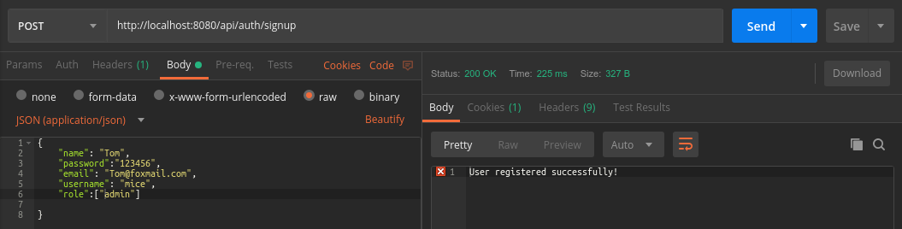
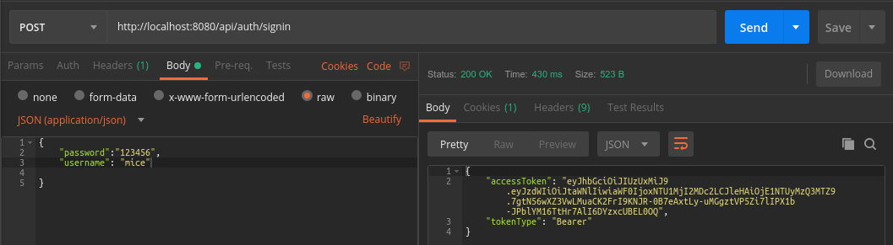
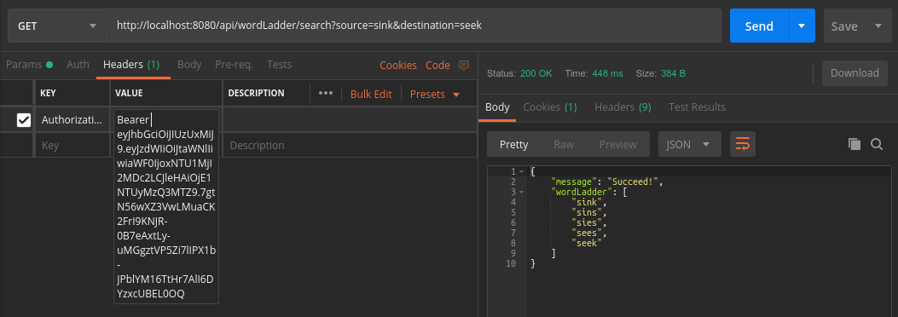
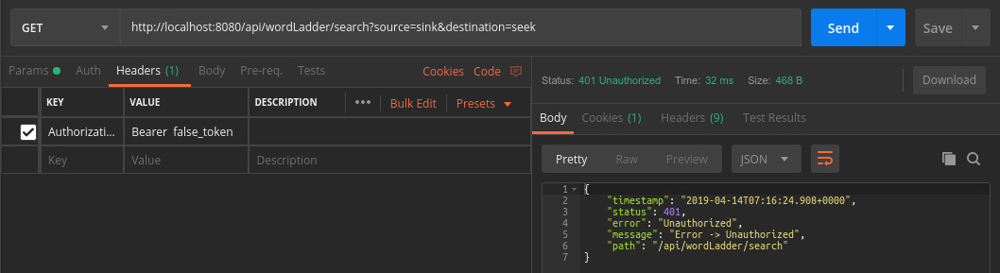
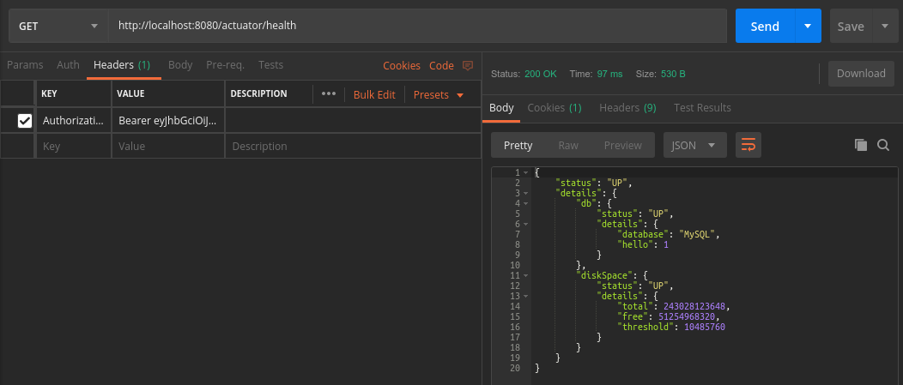
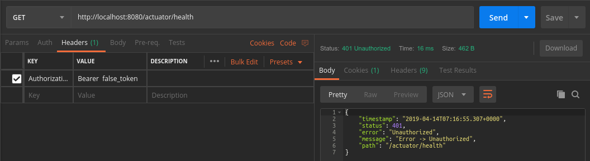

# WordLadder

## User Guide

0. Change file in the /src/main/resources/application.properties to match your database.
1. Install dependencies and build: ```mvn intall```
2. Test: ```mvn test```
3. Run: ```mvn spring-boot:run```
4. Usage: Use **Postman** to send GET or POST request. 

* Register


* Sign in

Copy json web token (jwt) and paste it into the header, and you will be authorized. 

* Get wordLadder with jwt


* Get wordLadder without token


* Get actuator endpoint with token


* Get actuator endpoint with out tokens



## JUnit test
* Test jwtProvider.java, which is a util class to generate and validate jwt.(/src/test/java/org/liu/se418/Jwt/JwtProviderTest)
* Test WordLadder.java to make sure it works. (/src/test/java/org/liu/se418/wordLadder/WordLadderTest)
* Test WordLadderController.java. I register and login a admin user to get the jwt. User with role "user" or "admin" can have access to the word ladder.
(/src/test/java/org/liu/se418/wordLadder/WordLadderControllerTest)
* Test Actuator.
* Use java reflect method to access private method.
* Use surefire plugin to generate test report, which can be found  in /target/site/surefire-report.html


