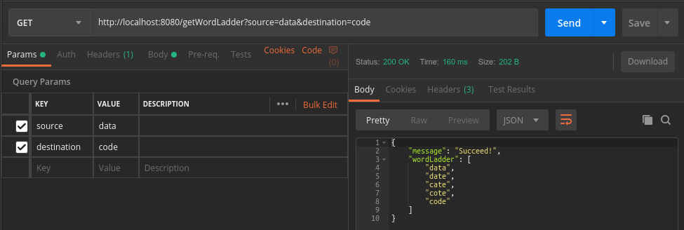
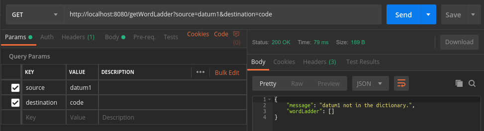
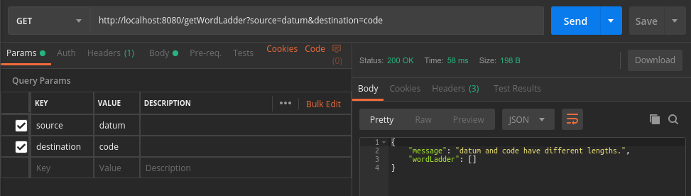
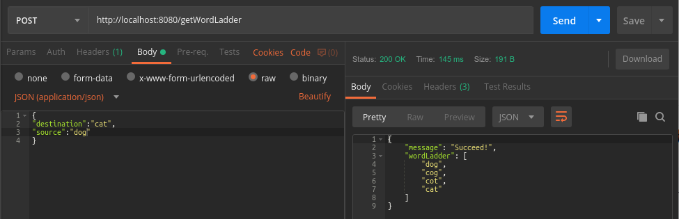
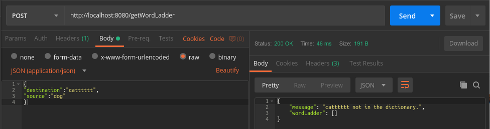
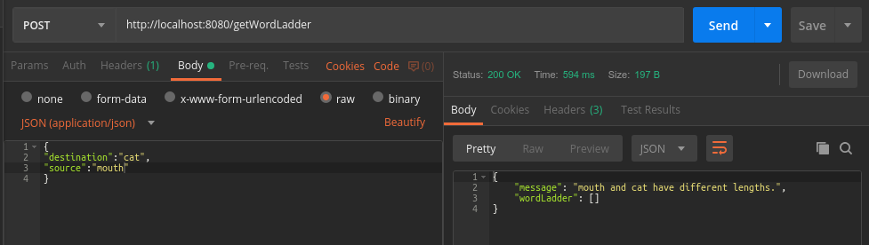

# WordLadder

## User Guide

1. Install dependencies and build: ```mvn intall```
2. Test: ```mvn test```
3. Run: ```mvn spring-boot:run```
4. Usage: Use **Postman** to send GET or POST request. 
If succeeding, you will get the word ladder and successful message. Otherwise, you will get an empty word ladder and corresponding error message.
Details are as follows:
* GET





* POST





## JUnit test

* Test both WordLadder.class and WordLadderController.class
* Use java reflect method to access private method.
* Use surefire plugin to generate test report, which can be found  in /target/site/surefire-report.html
* Use jacoco to analyse the test code coverage. The coverage report can be found in /target/jacoco.exec
