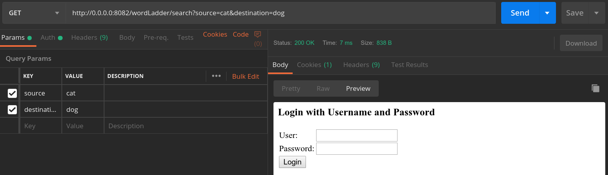
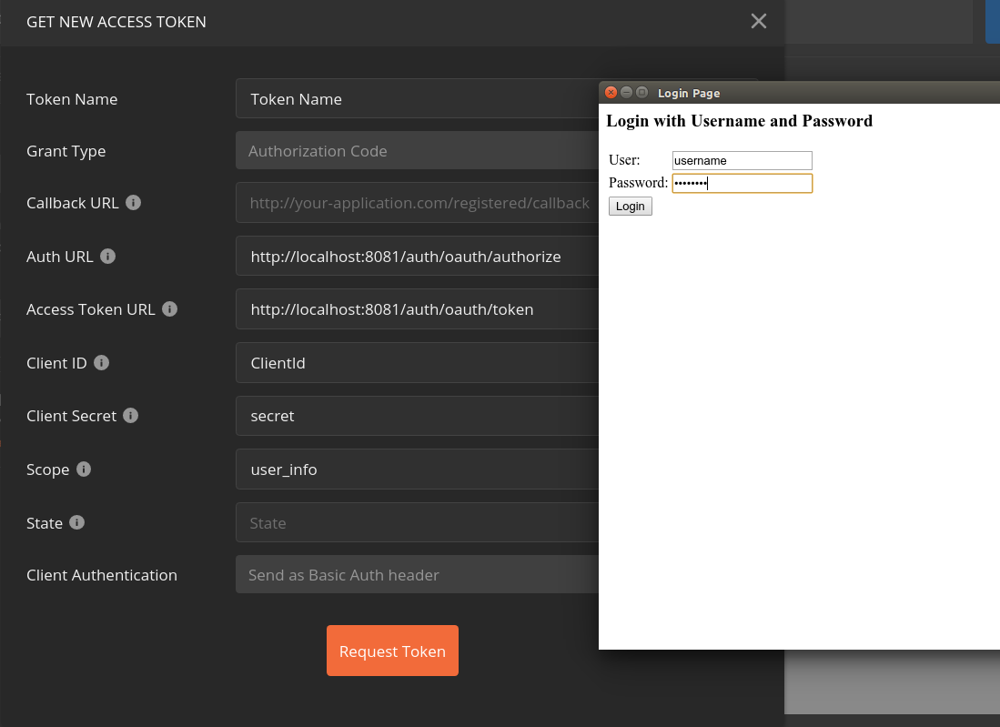
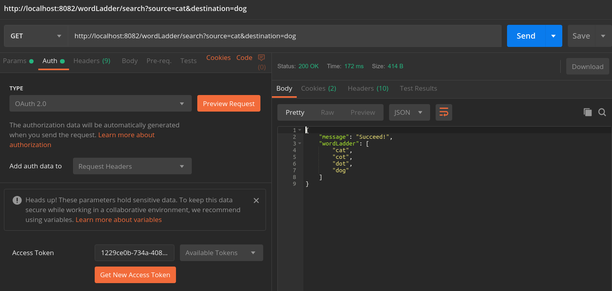

# split wordLadder

## Usage
run word ladder project
```
cd wordladder-oauth-consumer
mvn spring-boot:run
```

run authentication project
```
cd wordladder-oauth-server
mvn spring-boot:run
```

get wordLadder without authentication will redirect to the login page of wordladder-oauth-server


This project uses oauth2 authentication code type. Use postman to login. The username is 'username' and password is 'password'.


After authentication, we can access word ladder.


## docker
you can get project from docker
```
docker pull 1197744123/wordladder-oauth2-consumer
docker pull 1197744123/wordladder-oauth2-server
```