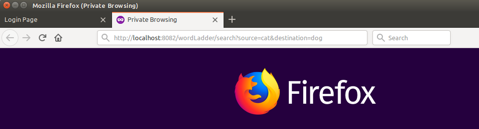
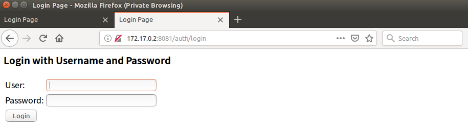
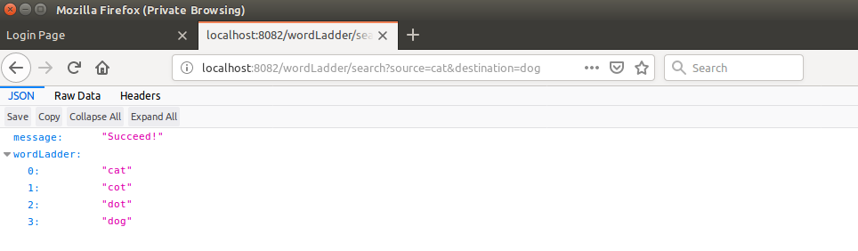

# split wordLadder
In this homework, I finish authentication flow using spring **Spring Oauth2**. The username is 'username' and password is 'password'.

## Usage
run word ladder service
```
cd wordladder-oauth-consumer
mvn spring-boot:run
```

run authentication service
```
cd wordladder-oauth-server
mvn spring-boot:run
```

get wordLadder without authentication will redirect to the login page of wordladder-oauth-server


This project uses oauth2 authentication code type. Use postman to login. The username is 'username' and password is 'password'.


After authentication, we can access word ladder.


similar result using browser




## Dockerized Usage
you can get project from dockerhub
```
docker pull 1197744123/wordladder-oauth2-consumer
docker pull 1197744123/wordladder-oauth2-server
```

run authentication service first:
```
docker run --name oauth-server  1197744123/wordladder-oauth2-server:latest
```
run word ladder service
```
docker run -p 8082:8082 -e AUTH_SERVER=$(docker inspect -f '{{range .NetworkSettings.Networks}}{{.IPAddress}}{{end}}' oauth-server)   1197744123/wordladder-oauth2-consumer:latest java -jar /app.jar

```
**Explanation for dockerized word ladder service:** 
问题: Oauth2用到了跳转页面，因此docker --link将无效。因为--link 的作用是将ip 与 docker container name的映射关系放于/etc/hosts，仅在容器内使用url可正常将container name转换为ip地址。但跳转时url将不经过hosts的映射直接显示在宿主机器上。
举例而言，正如上文将auth server的container命名为auth-server，即若在docker宿主机器浏览器上输入
```
http://localhost:8082/wordLadder/search?source=cat&destination=dog
```
而页面将跳转到
```
http://auth-server:8081/auth/oauth/authenrize?redirect_url...(省略)
```

解决办法： 此处利用环境变量解决此问题，在word ladder service 中的application.yml可以看到
```
  oauth2:
    client:
      clientId: ClientId
      clientSecret: secret
      accessTokenUri: http://${AUTH_SERVER:localhost}:8081/auth/oauth/token
      userAuthorizationUri: http://${AUTH_SERVER:localhost}:8081/auth/oauth/authorize
    resource:
      userInfoUri: http://${AUTH_SERVER:localhost}:8081/auth/principal

```
而在运行word ladder service时使用
```
-e AUTH_SERVER=$(docker inspect -f '{{range .NetworkSettings.Networks}}{{.IPAddress}}{{end}}' oauth-server)
```
找到oauth-server的ip地址并且设置它为环境变量AUTH_SERVER。

另外不能将java -jar /app.jar设置为Dockerfile中的ENTRYPOINT，否则无法先设置环境变量再运行程序。
