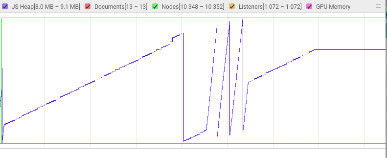
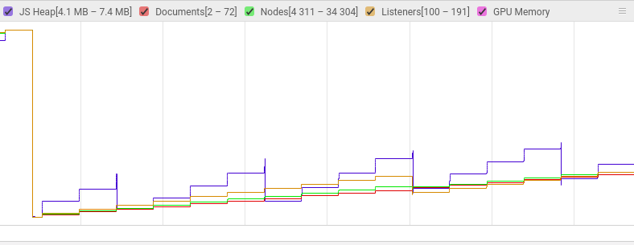

# Task 1: 利用chrome浏览器研究交大官网


## 研究对象


### 加载时间

在寝室网条件下，DOMContentLoad平均时间为800ms，完全加载（包括css，js，图片等静态文件）平均需要3.5s。列出了部分影响时间的图片文件（下载时间指不考虑阻塞时间，仅下载文件所用时间）：

| 文件           | 下载时间（ms）  |
| ------------- |:-------------:|  
| qsxLibrary.png    | 258      |  
|   oldbuilding.png    |    252 |
| column-1.jpg (石狮子图片) | 266   |

建议压缩这些图片清晰度或者加入缓存提高网站速度。

### html页面

 上海交通大学logo图片未写alt。
源代码
```

```

### 仍使用HTTP/1.1
根据[google best practice](https://developers.google.com/web/tools/lighthouse/audits/http2)
HTTP/2可以更快，更省数据量地访问资源。

交大官网大部分资源仍大量使用http/1.1协议，
以下是部分例子
```
https://www.sjtu.edu.cn
…ETUI/ETUI3.min.css(www.sjtu.edu.cn)
…ETUI/ETUI3.Utility.css(www.sjtu.edu.cn)
…OwlCarousel/owl.carousel.css(www.sjtu.edu.cn)
…OwlCarousel/owl.theme.default.css(www.sjtu.edu.cn)
…css/keyframes.css(www.sjtu.edu.cn)
...
```

### 使用了document.write()

根据[google best practice](https://developers.google.com/web/tools/lighthouse/audits/document-write) document.write() 对于使用2G，3G等网络质量较差的用户，document.write()将极大的降低页面渲染速度。

而交大官网页面下/resource/assets/js/headersy.js中通篇使用了document.write()。

### 无meta description

meta description可以有益于搜索引擎更精确找到页面。

### 内存泄漏
怀疑有内存泄漏，关闭页面操作才让heap曲线（紫色）降下来。



## 对比研究

以下与复旦官网进行对比

### 加载时间
在寝室网条件下，DOMContentLoad平均时间为500ms，完全加载（包括css，js，图片等静态文件）平均需要2.0s。

原因是多次刷新后，网站将所有的图片信息进行了缓存。

### html页面
部分图片也未使用alt属性（比交大还多）。

### 未使用HTTPS
47个资源请求未使用HTTPS协议，有安全隐患。
```
/mindex.html(www.fudan.edu.cn)
…css/bootstrap.min.css(www.fudan.edu.cn)
/fudanIndex/style.css(www.fudan.edu.cn)
…line-icons/line-icons.css(www.fudan.edu.cn)
…css/font-awesome.min.css(www.fudan.edu.cn)
/fudanIndex/header.css(www.fudan.edu.cn)
...
```

### 仍使用HTTP/1.1
也仍在大量使用HTTP/1.1.

### 内存泄漏

无内存泄漏



## 总结
交大图片在反复刷新后仍要200ms时间下载。复旦的所有图片都进缓存，因此多次刷新后，重复请求会快些。
两者都仍在使用HTTP/1.1协议。交大使用的document.write()插入脚本降低了性能，而且怀疑有内存泄漏。复旦有47个资源请求未使用HTTPS，有安全隐患。
