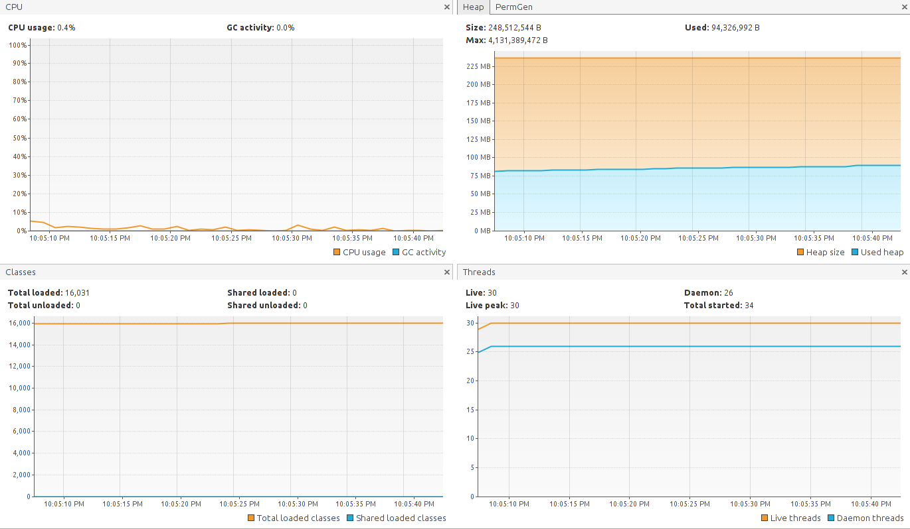
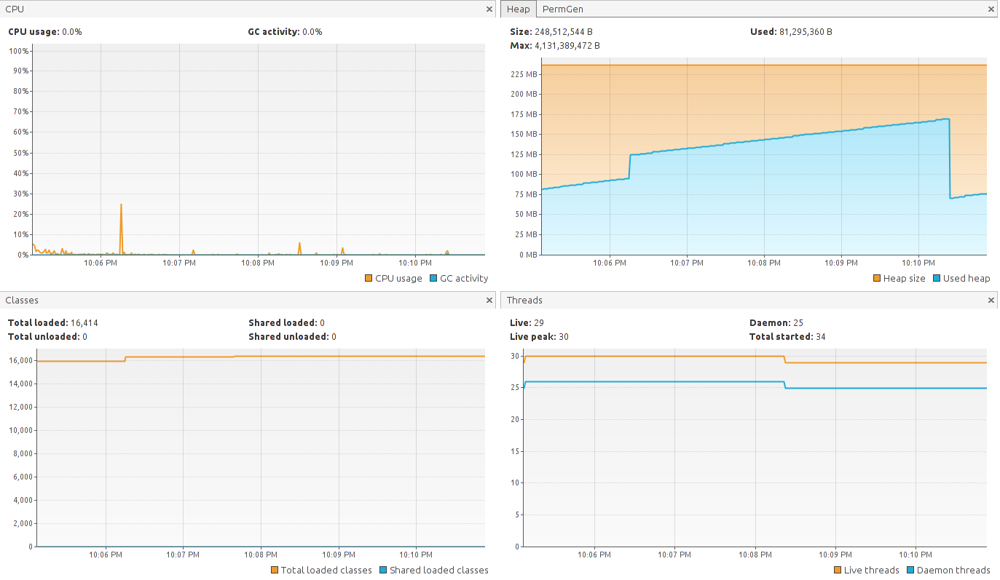
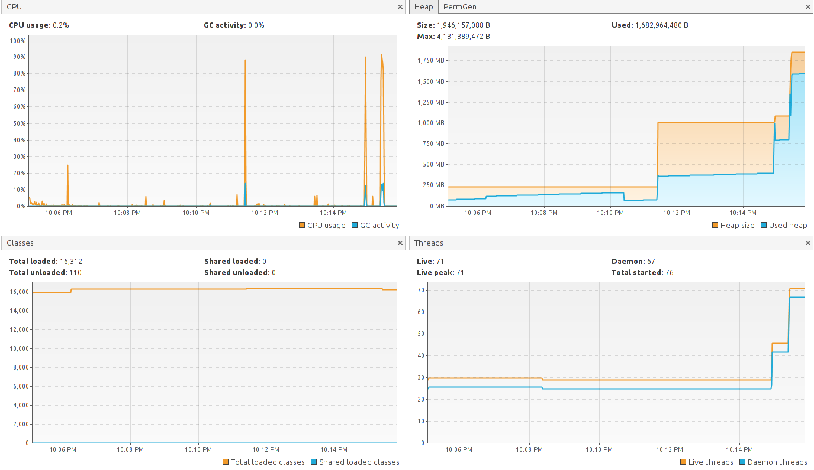
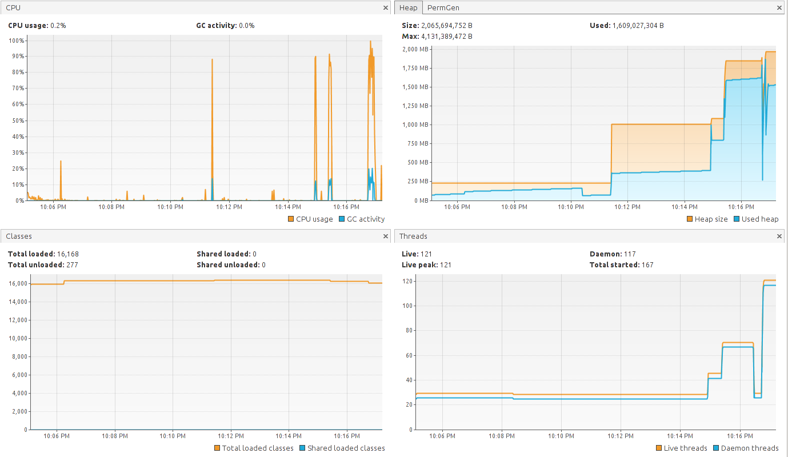
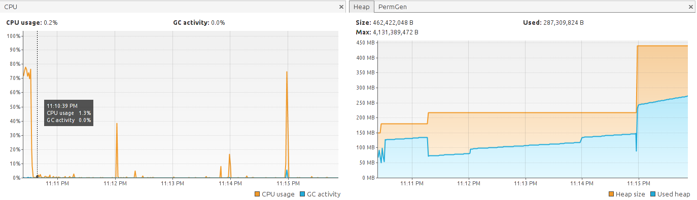

# Task 2
Find the resources consumption of your REST service:
1. Run your service on your desktop or laptop
2. Get the CPU、Memory consumpution of it when there is no requests
3. With the increasing requests, find out the trend of each resource utilization

## Tools

1. java visualVM
2. ApacheBench

## result

### case1：为每个wordLadder请求新建字典。
```
@RequestMapping(value = "/api/wordLadder/search", method = RequestMethod.GET)
    public WordLadder getWordLadder(@RequestParam("source") String word1，@RequestParam("destination") String word2) throws IOException {
        ClassPathResource dictionary = new ClassPathResource("SmallDict.txt");
        WordLadder wordLadder = new WordLadder(dictionary.getFile().getAbsolutePath());
        wordLadder.findWordLadder(word1, word2);
        return wordLadder;
    }
```

1. 空闲状态CPU占用率接近0.4%，内存占用率为80M左右。
 

2. 仅发送一次请求，cpu usage 达到了25%，内存占用率持续升高（不知道为什么？）达到160M后回收了内存。
```
ab -n 1 -c 1 "http://localhost:8080/api/wordLadder/search?source=cat&destination=dog"
```


3. concurrent请求达到25时，瞬时cpu使用率已超过80%。
```
 ab -n 50 -c 25 "http://localhost:8080/api/wordLadder/search?source=cat&destination=dog"

```
   

4. concurrent请求达到100时，持续时间内cpu使用率达到100%。而且50%的请求时间超过5.8s，这难以接受。
```
ab -n 200 -c 100 "http://localhost:8080/api/wordLadder/search?source=cat&destination=dog"
```
```
Percentage of the requests served within a certain time (ms)
  50%   5875
  66%   6925
  75%   7879
  80%   8439
  90%  10325
  95%  11936
  98%  12429
  99%  12737
 100%  12775 (longest request)

```


 case1 总结：仅100个并发请求已经使得cpu达到极限，而且内存占用率从80M达到2G，而且内存回收缓慢（为什么？）; 但值得注意的是所有的请求都成功了。

### case 2: 仅利用一个字典(将字典传入WordLadder中，再将WordLadder加入bean factory)。

WebSecurityConfig.java
```
    @Bean
    public WordLadder getWordLadder() throws IOException {
        ClassPathResource dictionary = new ClassPathResource("SmallDict.txt");
        WordLadder wordLadder = new WordLadder(dictionary.getFile().getAbsolutePath());
        return wordLadder;
    }
```

WordLadderController.java
```
    @Autowired
    private WordLadder wordLadder;

    
    @RequestMapping(value = "/api/wordLadder/search", method = RequestMethod.GET)
    public WordLadder getWordLadder(@RequestParam("source") String word1, @RequestParam("destination") String word2) throws IOException {
        wordLadder.findWordLadder(word1, word2);
        return wordLadder;
    }
```
1. no Request 与 one Request 情况与case 1 同。
2. 200个并发request, CPU消耗不到80%，内存维持在320M。以为很优于case 1，发现171个请求都失败了orz。。。
```
Concurrency Level:      200
Time taken for tests:   1.547 seconds
Complete requests:      200
Failed requests:        171
   (Connect: 0, Receive: 0, Length: 171, Exceptions: 0)
Non-2xx responses:      1
``` 

case2 总结： wordLadder并发request有错误，更加无法接受。

暂时未找到解决方法。
