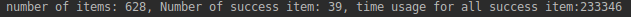
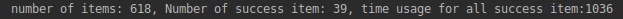

# Task 4

## Intro

### Role
There are 3 role in the project.
1. Producer. Generate item and put it into the container.
2. Consumer. Remove item from container. If the number of items in the container is greater than 20, then LIFO is used. Otherwise, FIFO is used.
3. TimeoutMonitor. Monitor the items in the container. If the time of one item staying at the container exceed the preset timeout, then the item is eliminated.

### Result
I simulate the situation where request production is way faster than request consumption.

If not implement threshold based consumer, that is to say, FIFO is the only policy, then the result is

If implement both FIFO and LIFO, then the result is

So the threshold policy does decrease time consumption a lot for success request if there are lots of concurrent requests.

